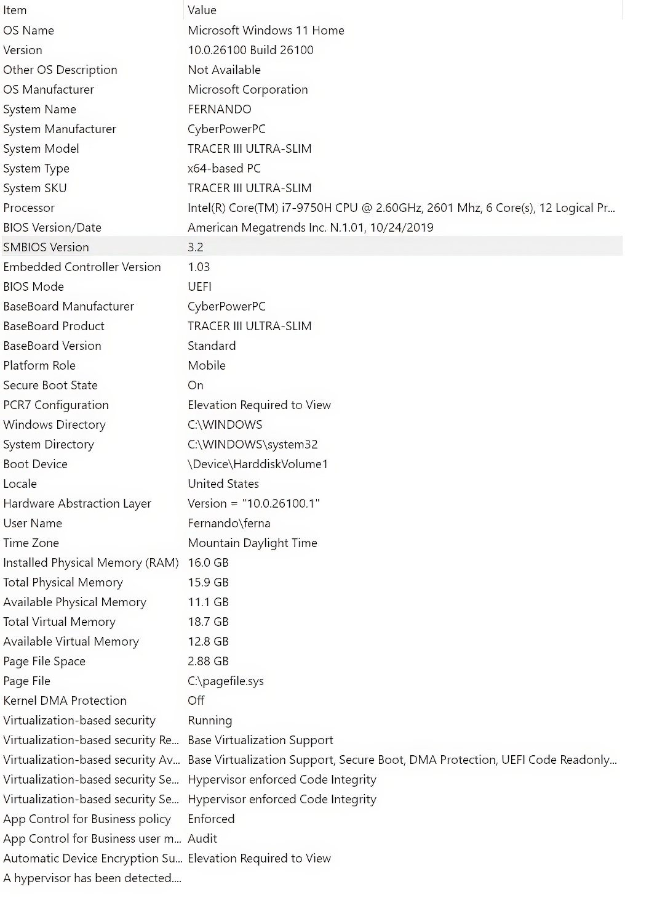
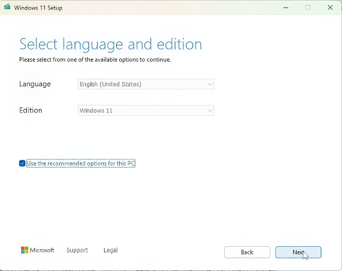
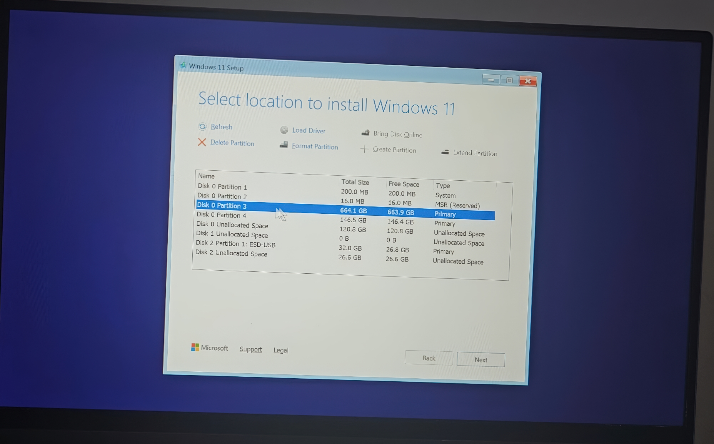
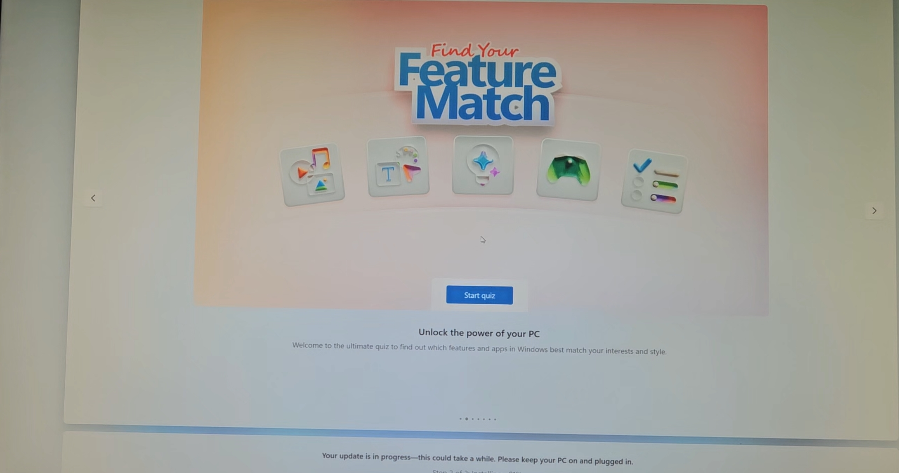
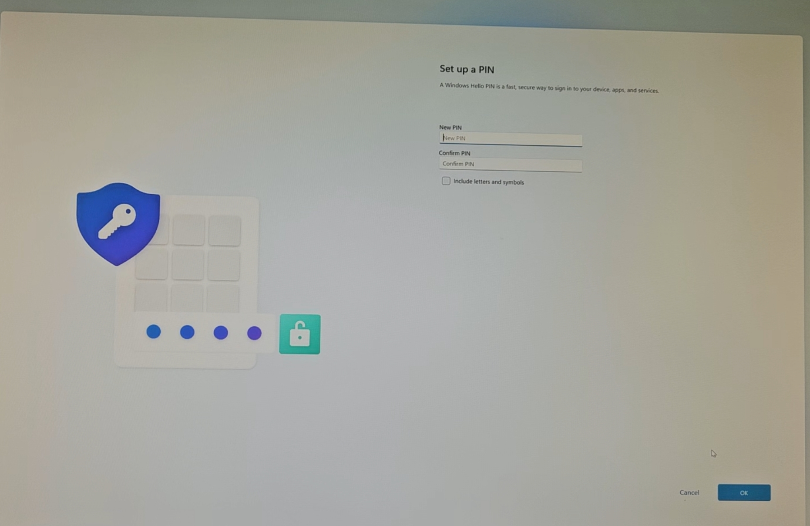
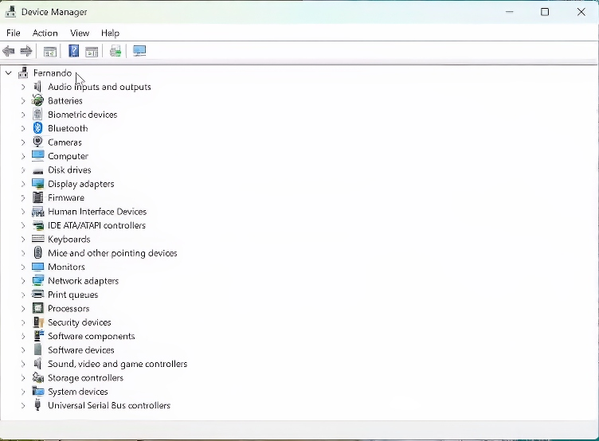
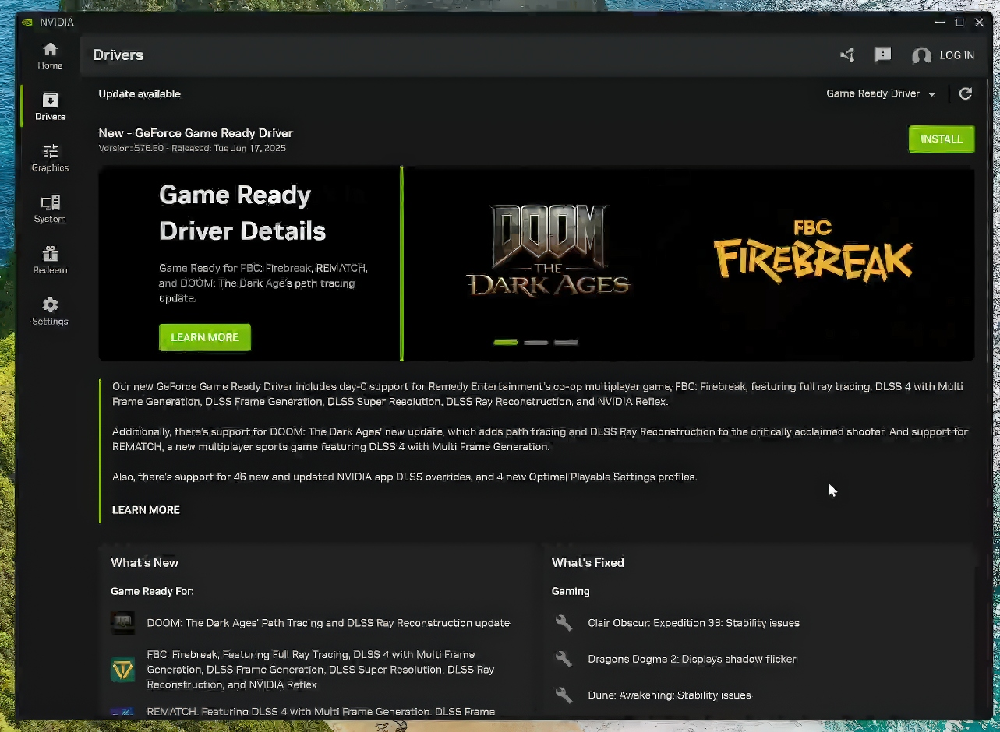
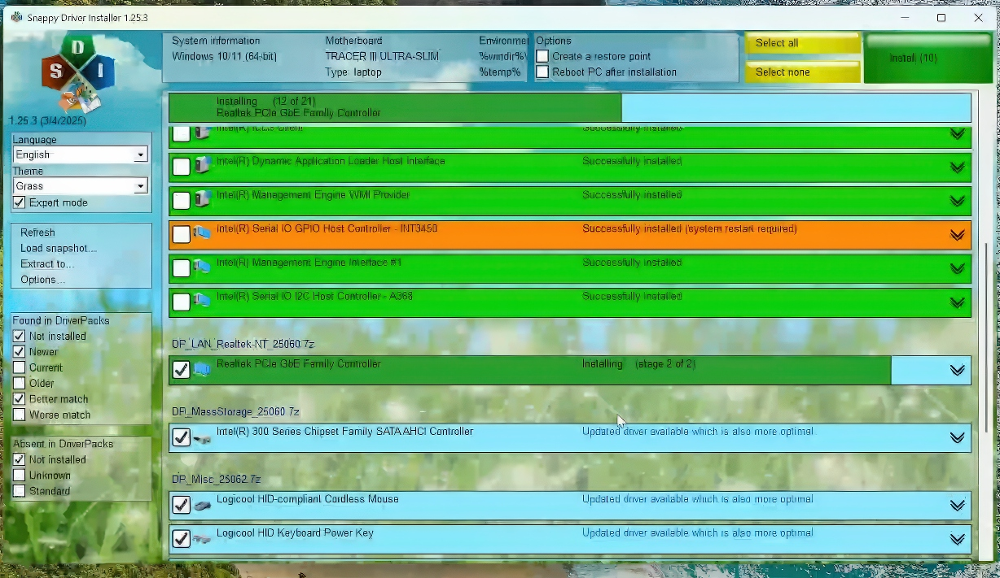

# 💻 Project – Windows 11 Pro Clean Installation and Partition Setup

This project documents the full process of wiping a laptop's internal drive, creating custom partitions, and performing a clean installation of **Windows 11 Pro**. It includes steps for driver setup, essential software installation using professional tools, and system optimization for daily use.

> 📁 This is part of my personal IT portfolio to demonstrate skills in system installation, partitioning, driver management, and post-install setup.

---

## 🖥️ Laptop Specifications

CyberPowerPC TRACER III ULTRA-SLIM

| Field | Value |
|-------|-------|
| **System Model** | TRACER III ULTRA-SLIM |
| **Manufacturer** | CyberPowerPC |
| **Processor** | Intel Core i7-9750H @ 2.60GHz, 6 Cores / 12 Threads |
| **Installed RAM** | 16 GB |
| **System Type** | x64-based PC (64-bit) |
| **OS Version** | Windows 11 Pro 10.0.26100 |

📷 System Info Screenshot  

---

## 🎯 Project Objectives

- Fully format the internal drive (no backup needed)
- Create two main partitions: system and personal
- Install Windows 11 Pro from a bootable USB
- Update all drivers
- Install daily-use apps with Ninite
- Leave room for Linux dual boot

---

## ⚙️ Tools Used

- [Windows Media Creation Tool](https://www.microsoft.com/software-download/windows11)
- [Snappy Driver Installer Origin](https://sdi-tool.org/)
- [Ninite](https://ninite.com/)
- [NVIDIA App](https://www.nvidia.com/en-us/software/nvidia-app/)
- Device Manager & Windows Update

---

## 🔧 Installation Process

### 1. Create Bootable USB  

### 2. Format Drive and Create Partitions  

### 3. Install Windows 11 Pro  

### 4. Complete Initial Setup  

---

## 🧰 Post-Installation Configuration

### ✅ Drivers
- Used Device Manager and Windows Update  

- Installed NVIDIA driver  

- Used Snappy Driver Installer for missing drivers  

### ✅ Software Setup with Ninite
  
Apps installed:
- Visual Studio Code
- VLC, Audacity, Spotify
- Discord, Opera, Firefox
- GIMP, WinRAR, Notepad++
- TeamViewer, .NET 4.8.1

---

## 📦 Final Result

The laptop is now running **Windows 11 Pro**, fully updated and configured with essential tools. All drivers are correctly installed, and the system is ready for productivity, study, or daily use.

---

## 🧠 Skills Demonstrated

- System formatting and OS installation
- Disk partitioning for dual-boot readiness
- Driver detection and manual installation
- Efficient software deployment
- Post-install system optimization

---

📄 **[Read the full PDF documentation](Windows%2011%20Pro%20Clean%20Installation%20and%20Partition%20Setup.pdf)**  
🎥 *Video coming soon*
